# Perf UGC Ads — Lenskart AI UGC Ad Engine

A scalable system for producing **performance UGC ads for Lenskart eyewear** with AI — creator/testimonial-style videos (TikTok / Reels / Shorts) generated from a Google Sheet of product IDs, rendered on **Higgsfield**, organised in **Google Drive**, and driven by two Claude **skills** (a creative brain and an ops brain).

> **Continuity repo.** This holds everything needed to resume the project on a new machine: skills, pipeline code, the knowledge base, and a copy of the project memory. Large binaries (videos, music) and PII reference photos are **not** committed — they live in Google Drive. Secrets are never committed.

---

## Architecture

```mermaid
flowchart TD
    subgraph CTRL["🎛️ Control plane"]
        SHEET["Google Sheet<br/>Ugc-bot-automation<br/>(1 row per PID)"]
    end

    subgraph BRAINS["🧠 Two Claude skills"]
        CREATIVE["ugc-ads<br/><i>creative brain</i><br/>scripts · voice · models · prompts"]
        OPS["ugc-bot-automation<br/><i>ops brain</i><br/>sheet ↔ drive ↔ render plumbing"]
    end

    subgraph GEN["🎬 Higgsfield (generation)"]
        MS["Marketing Studio<br/>A.1 Talking Head<br/>avatar + product + TTS lip-sync"]
        SEED["Seedance 2.0<br/>A.2 Split-Screen<br/>image refs · consistent identity"]
        NANO["Nano Banana Pro<br/>model & avatar stills"]
    end

    subgraph STORE["🗂️ Storage"]
        DRIVE["Google Drive<br/>per-PID folders + _Models"]
        LOCAL["Local Ads/<br/>raw + finals + product_src"]
    end

    SHEET -->|read rows| OPS
    OPS --> CREATIVE
    CREATIVE -->|script / prompt| GEN
    DRIVE -->|input product images| OPS
    NANO --> SEED
    MS --> LOCAL
    SEED --> LOCAL
    LOCAL -->|post-produced finals| DRIVE
    OPS -->|write outputs, job IDs, links| SHEET

    OPS -. "reads: Drive MCP connector (as user)" .-> DRIVE
    OPS -. "writes: OAuth via pipeline/gauth.py" .-> DRIVE
    OPS -. "writes: OAuth via pipeline/gauth.py" .-> SHEET
```



**Why two write paths:** the org blocks service-account sharing and automated-browser Google logins. So **reads** go through the Google Drive MCP connector (authed as the user) and **writes** (Sheet cells, Drive uploads) go through `pipeline/gauth.py` (OAuth as the user). See [`docs/memory/ugc-bot-automation.md`](docs/memory/ugc-bot-automation.md).

---

## Ad taxonomy

Every ad is one of two **types**; Product-First has several **production formats**:

| Code | Format | What it is | Engine | Status |
|------|--------|-----------|--------|--------|
| **A.1** | Talking Head | Creator talks straight to camera about the product | Marketing Studio (avatar + product, TTS lip-sync) | 🔒 **Locked** |
| **A.2.1** | Split-Screen (3-split) | Outdoor lifestyle flex — model walking / POV hand / wide tracking, music-driven, no talking | Seedance 2.0 (image refs) | 🔒 **Locked** |
| **A.2.2** | Split-Screen (2-split) | Studio beauty flex — model wearing frames / product in-hand, music-driven | Seedance 2.0 (image refs) | 🔒 **Locked** |
| **A.3** | Product Modelling | Product worn/used on a model, motion/showcase emphasis | TBD | 🚧 Next |
| **B** | Yapping | Creator rambles a relatable story, then pivots to product | Seedance 2.0 | 🚧 Planned |

Full, validated recipes (params + gotchas) live in:
- A.1 → [`docs/memory/higgsfield-ms-generation-recipe.md`](docs/memory/higgsfield-ms-generation-recipe.md)
- A.2 → [`docs/memory/seedance-split-screen-recipe.md`](docs/memory/seedance-split-screen-recipe.md)
- Voice/brand rules → [`docs/memory/ugc-script-voice-rules.md`](docs/memory/ugc-script-voice-rules.md)

### Locked brand-voice rules (Lenskart)
- Hinglish in Roman script; **English words are the TTS pronunciation risk**.
- Brand name always written **"Lens Kart"** (two words) — "Lenskart" mis-renders as "Leshkart".
- Never "sasta"/"budget" → always **affordable / premium**. Premium positioning.
- No spec dumps; short, Gen-Z; always a relatable use-case; clear app + virtual-try-on CTA.
- **Script approval gate** before spending generation credits.

---

## Repo structure

```
.
├─ README.md                     ← you are here
├─ KNOWLEDGE_BASE.md             ← deep project notes
├─ docs/memory/                  ← project "memory" (continuity brain), one fact per file
├─ Claude skills /               ← packaged .skill bundles
│   ├─ ugc-ads.skill             ← creative brain (A.1/A.2 recipes, voice rules)
│   └─ ugc-bot-automation.skill  ← ops brain (sheet↔drive↔render)
├─ pipeline/
│   ├─ gauth.py                  ← OAuth-as-user write path (Drive upload, Sheet cells)
│   ├─ sheet.py                  ← service-account path (PARKED — org blocks SA)
│   ├─ config.json · README.md
├─ Ads/                          ← outputs, organised per PID (videos gitignored → Drive)
│   ├─ <PID>_<slug>/
│   │   ├─ A1_Talking-Head/{raw,final}/
│   │   ├─ A2.1_Split-Screen_3split/{male,female}/
│   │   ├─ A2.2_2split/{male,female}/
│   │   └─ _product_src/
│   └─ _Models/{male,female}/    ← reusable AI fashion models
├─ Avatars/                      ← 6 registered talking-head avatars (A.1)
└─ Plus_Jakarta_Sans/            ← brand font
```

**Not in git (by design):** generated videos (`*.mp4`), music tracks (`Music/`), real-person reference photos (`Female face ref/`), and all secrets (`.secrets/`). Videos live in Google Drive; secrets are re-minted per machine.

---

## New-machine setup (continuity)

1. `git clone` this repo.
2. Install the two skills into `~/.claude/skills/` (unzip the `.skill` bundles) and restore `docs/memory/` into `~/.claude/projects/<project-hash>/memory/`.
3. Re-create `.secrets/` and re-mint the OAuth token: `python3 pipeline/gauth.py login` (needs the Desktop OAuth client JSON).
4. Re-enable Drive API + Sheets API on the GCP project; reconnect the Google Drive MCP connector.
5. Re-fetch large assets (videos/music) from Google Drive.

Details in [`docs/memory/ugc-bot-automation.md`](docs/memory/ugc-bot-automation.md) (migration section).

---

## Pipeline flow (bulk)

1. **`run scripts`** — read PID rows → read product page → write Claude script to the sheet → **stop at approval gate**.
2. *(human)* review script, set Status.
3. **`run approved`** — pick model/avatar → load product into Higgsfield → generate → download raw locally → post-produce → upload final to Drive → write `Video Output` + Job IDs + `Status=Done`.

Generation cost ≈ **75 cr / 15s** (Marketing Studio) and ≈ **67.5 cr / 15s** (Seedance 2.0). Always show a credit estimate before generating.
